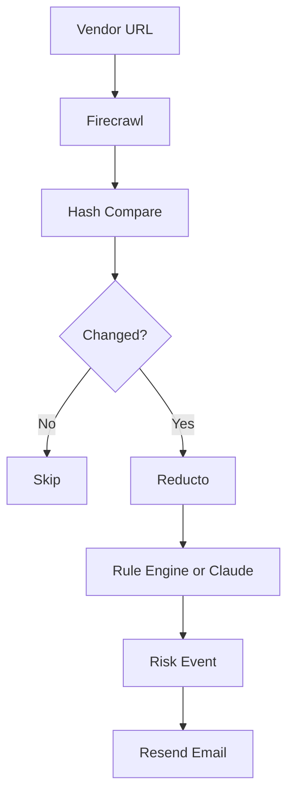
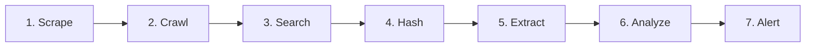

<div className="flex items-center gap-3">
  
  <h1 className="text-2xl md:text-3xl font-semibold tracking-tight">
    VendorWatch | Y Combinator and MongoDB Hackathon
  </h1>
</div>

<div align="left">
VendorWatch is a vendor risk monitoring system that tracks changes to what third-party vendors actually and officially commit to. It focuses on vendor terms of service, privacy policies, security documentation, pricing pages, and SLAs — the sources that define legal, financial, and compliance exposure. The system continuously crawls vendor websites and extracts structured information such as liability limits, indemnification language, billing and refund terms, data residency practices, compliance references, and uptime guarantees. This turns dense legal and policy text into machine-readable data. VendorWatch stores versioned snapshots of these vendor commitments, allowing it to detect meaningful changes over time. When differences appear, it generates categorized risk alerts across legal, financial, data and security, and operational domains. Teams are notified so they can review potential exposure early, rather than discovering issues after an incident or dispute. External news and status pages are surfaced separately for context, but risk analysis is based strictly on official vendor commitments.
</div>

## Two Person Team (w/ Aryansh Shrivastava @ UC Berkeley)

This was an ambitious project to undertake in the eight hour time-frame allotted. Grateful to experience something new with everyone I met, and
immense recognition to my teammate Aryansh Shrivastava (UC Berkeley) for developing this project with me! 
<br />

## Tech Stack Broad Overview


</div>

---

## Table of Contents

- [Features](#features)
- [Architecture](#architecture)
- [Tech Stack](#tech-stack)
- [Project Structure](#project-structure)
- [Prerequisites](#prerequisites)
- [Installation](#installation)
- [Configuration](#configuration)
- [Development](#development)
- [Production](#production)
- [API Reference](#api-reference)
- [Monitoring Pipeline](#monitoring-pipeline)
- [Deployment](#deployment)
- [Scheduled Monitoring](#scheduled-monitoring)

---

## Features

**Vendor Management**
- Add vendors by website URL with duplicate detection by domain
- Plan-based vendor limits (Basic: 5, Premium: 15, Enterprise: 500)
- Vendor selection for targeted monitor runs

**Monitoring**
- Single-page scrape via Firecrawl
- Multi-page crawl on first snapshot (terms, privacy, legal, pricing)
- External risk signals via Firecrawl search (news and web for breach, security, layoffs, incidents)
- Content hash comparison for change detection

**Risk Analysis**
- Two research modes: Basic (rule-based) and Deep (AI-powered via Anthropic Claude)
- Structured extraction from terms, privacy policies, and PDFs via Reducto
- Risk findings grouped by Legal, Data and Security, Financial, Operational
- Recommended actions derived from extracted liabilities

**Alerts**
- Configurable email alerts (Resend) for low, medium, and high severity
- Test email endpoint for verification

**Export**
- Download vendor snapshot data as JSON, CSV, or Markdown

**UI**
- Light and dark mode with persisted preference
- Tabbed dashboard (Overview, Vendors, Risk Alerts, Extracted Content)
- Real-time progress for monitor runs via Server-Sent Events

---

## Architecture

### Frontend

- **Framework:** Next.js 16 App Router, React 19
- **Styling:** Tailwind CSS v4 with CSS variables for theming
- **State:** Local component state and `useEffect` for data fetching
- **Theme:** Context provider with localStorage persistence; inline script prevents flash on load

**Key Components**
- Single-page app (`src/app/page.tsx`) with tab-based navigation
- Overview: summary cards, vendor selection, research mode, pipeline diagram, email preferences, last run results
- Vendors: add form, monitored vendors list grouped by domain
- Risk Alerts: risk events with structured findings, extracted terms table, external sources, recommended actions
- Extracted Content: snapshot selector with raw text and structured data preview

### Backend

- **API:** Next.js Route Handlers under `src/app/api/`
- **Database:** MongoDB with three collections (vendors, snapshots, riskEvents)
- **Services:** Modular lib under `src/lib/services/` for scraping, extraction, analysis, alerting

**Request Flow**
- Client fetches vendors, snapshots, risk events, plan, research mode, alert preferences via GET endpoints
- Monitor triggered via POST to `/api/run-monitor` (sync) or `/api/run-monitor-stream` (SSE)
- Cron endpoint `/api/cron/run-monitor` intended for external schedulers

### Data Flow



---

## Tech Stack

<p align="center">
  
  
  
  
  
  
</p>

| Layer | Technology |
|-------|------------|
| **Frontend** | Next.js 16, React 19, Tailwind CSS v4 |
| **Backend** | Next.js Route Handlers, Node.js |
| **Database** | MongoDB |
| **Scraping** | Firecrawl |
| **Document extraction** | Reducto |
| **Risk analysis** | Anthropic Claude (Deep mode) or rule engine (Basic mode) |
| **Email** | Resend |
| **Deployment** | Railway |

---

## Project Structure

```
src/
├── app/
│   ├── api/                    # Route handlers
│   │   ├── alert-preferences/  # GET/POST severity prefs
│   │   ├── alert-test/         # POST test email
│   │   ├── cron/run-monitor/   # POST cron entry point
│   │   ├── plan/               # GET current plan
│   │   ├── research-mode/      # GET/POST Basic vs Deep
│   │   ├── risk-events/        # GET risk events
│   │   ├── run-monitor/        # POST sync monitor
│   │   ├── run-monitor-cancel/ # POST cancel in-progress
│   │   ├── run-monitor-stream/ # POST SSE monitor
│   │   ├── snapshots/          # GET snapshots
│   │   │   └── [vendorId]/latest/  # GET latest for download
│   │   └── vendors/            # GET/POST vendors, DELETE [id]
│   ├── globals.css
│   ├── layout.tsx
│   └── page.tsx
├── lib/
│   ├── config/                 # Plans, alert prefs, research mode
│   ├── db/                     # MongoDB models and connection
│   ├── services/               # Business logic
│   │   ├── alert.ts            # Resend email alerts
│   │   ├── exportFormats.ts    # JSON/CSV/Markdown export
│   │   ├── firecrawl.ts        # Scrape, crawl, search
│   │   ├── hashing.ts          # Content hash for change detection
│   │   ├── llm-analysis.ts     # Anthropic Claude risk analysis
│   │   ├── monitor.ts          # Core monitoring cycle
│   │   ├── reducto.ts          # Document extraction
│   │   ├── risk-insights.ts    # Findings and recommended actions
│   │   ├── rule-engine.ts      # Rule-based risk detection
│   │   └── structured-summary.ts
│   ├── theme-provider.tsx
│   └── utils/                  # document-links, url helpers
scripts/
└── monitor.ts                  # CLI monitor (npm run monitor)
```

---

## Prerequisites

- Node.js 18 or later
- MongoDB (MongoDB Atlas recommended)
- API keys: Firecrawl, Resend, Reducto; Anthropic optional for Deep mode

---

## Installation

```bash
git clone <repository-url>
cd vendorwatch-1
npm install
```

---

## Configuration

Copy the example environment file and fill in your values:

```bash
cp .env.local.example .env.local
```

### Environment Variables

| Variable | Required | Description |
|----------|----------|-------------|
| MONGODB_URI | Yes | MongoDB Atlas connection string (see `.env.local.example` for format) |
| FIRECRAWL_API_KEY | Yes | From [firecrawl.dev](https://firecrawl.dev) |
| REDUCTO_API_KEY | Yes | From [reducto.ai](https://reducto.ai) for document extraction |
| RESEND_API_KEY | Yes | From [resend.com](https://resend.com) for email alerts |
| ALERT_EMAIL | Yes | Email address to receive risk alerts |
| ANTHROPIC_API_KEY | No | For Deep research mode; if omitted, falls back to Basic (rule-based) |
| ALERT_SEVERITIES | No | Comma-separated: `low`, `medium`, `high`. Default: `medium,high` |
| CRON_SECRET | No | Secret for cron endpoint; when set, requests must include Bearer token or `?secret=` |
| RESEND_FROM_EMAIL | No | Override sender (default: `VendorWatch <onboarding@resend.dev>`) |
| VENDORWATCH_PLAN | No | `basic`, `premium`, or `enterprise`. Default: `basic` |

---

## Development

Start the development server:

```bash
npm run dev
```

Open [http://localhost:3000](http://localhost:3000).

**Other commands**

```bash
npm run lint          # Run ESLint
npm run monitor       # Run one monitoring cycle from CLI (uses .env.local)
```

---

## Production

Build and start:

```bash
npm run build
npm start
```

The start script uses `PORT` when set (e.g. on Railway) and defaults to 3000 locally.

---

## API Reference

| Method | Path | Description |
|--------|------|-------------|
| GET | /api/vendors | List all vendors |
| POST | /api/vendors | Create vendor. Body: `{ name, website, category? }` |
| DELETE | /api/vendors/[id] | Delete vendor and cascade snapshots/risk events |
| GET | /api/snapshots | List snapshots. Query: `?vendorId=xxx` for one vendor |
| GET | /api/snapshots/[vendorId]/latest | Latest snapshot for download (JSON) |
| GET | /api/risk-events | List risk events. Query: `?vendorId=xxx` optional |
| POST | /api/run-monitor | Run full monitoring cycle (sync) |
| POST | /api/run-monitor-stream | Run monitor with Server-Sent Events progress. Body: `{ vendorIds?: string[] }` |
| POST | /api/run-monitor-cancel | Cancel in-progress monitor |
| POST | /api/cron/run-monitor | Cron entry point; requires CRON_SECRET when set |
| GET | /api/alert-preferences | Get severity prefs and email config status |
| POST | /api/alert-preferences | Set severities. Body: `{ severities: ["low","medium","high"] }` |
| POST | /api/alert-test | Send test email |
| GET | /api/plan | Get current plan and vendor usage |
| POST | /api/plan | Override plan (demo). Body: `{ plan: "basic"|"premium"|"enterprise" }` |
| GET | /api/research-mode | Get Basic or Deep |
| POST | /api/research-mode | Set mode. Body: `{ mode: "basic"|"deep" }` |

### Cron Authentication

When `CRON_SECRET` is set, requests must include one of:

- Header: `Authorization: Bearer YOUR_CRON_SECRET`
- Header: `x-cron-secret: YOUR_CRON_SECRET`
- Query: `?secret=YOUR_CRON_SECRET`

---

## Monitoring Pipeline



1. **Scrape** vendor homepage via Firecrawl
2. **Crawl** (first snapshot only) up to 3 pages for terms, privacy, legal
3. **Search** Firecrawl for vendor + risk keywords (breach, security, layoffs, etc.)
4. **Hash** extracted content and compare with last snapshot
5. **If unchanged** record result and continue
6. **If changed or first snapshot:**
   - Extract document links from content; try common paths (`/terms`, `/privacy`, etc.)
   - Call Reducto on up to 4 URLs to extract structured data (pricing, liability, compliance, SLA, etc.)
   - Store snapshot with `contentHash`, `extractedText`, `structuredData`
7. **Risk analysis:**
   - **Basic:** Rule engine compares structured fields; emits risk event on changes
   - **Deep:** Anthropic Claude analyzes content + structured data; produces severity, summary, recommended actions
8. **Risk findings:** Parse structured data into categorized findings (Legal, Data and Security, Financial, Operational)
9. **Recommended actions:** Built from findings when available
10. **Email:** Send via Resend if severity is in user preferences

### Structured Data Schema (Reducto)

Extracted fields: `pricing_terms`, `fee_structures`, `liability_clauses`, `indemnification_terms`, `termination_terms`, `renewal_terms`, `data_retention_policies`, `data_residency_locations`, `encryption_practices`, `compliance_references`, `sla_uptime_commitments`, `support_response_times`, `data_export_rights`.

### Research Modes

- **Basic:** Rule-based only. Compares structured data snapshots and fires on field changes. No LLM required.
- **Deep:** Uses Claude for summaries and recommendations. Falls back to structured-data-driven output when Claude is unavailable.

---

## Deployment

### Railway

1. Create a new project and connect the GitHub repository.
2. Railway will detect Next.js. Ensure:
   - Build command: `npm run build`
   - Start command: `npm start`
3. Add all environment variables in the project settings.
4. Deploy. The app listens on `PORT` provided by Railway.

### External Cron

Railway does not provide built-in cron. Use an external scheduler (e.g. [cron-job.org](https://cron-job.org), [Upstash Cron](https://upstash.com/cron)) to call the cron endpoint hourly:

**URL:**
```
POST https://your-app.up.railway.app/api/cron/run-monitor
```

**Headers:**
```
Authorization: Bearer YOUR_CRON_SECRET
```

Or use query parameter: `?secret=YOUR_CRON_SECRET`

**Schedule:** `0 * * * *` (every hour at minute 0)

---

## Scheduled Monitoring

Configure your external cron service with:

- **URL:** `https://<your-domain>/api/cron/run-monitor`
- **Method:** POST
- **Header:** `Authorization: Bearer <CRON_SECRET>` (or `?secret=<CRON_SECRET>`)
- **Schedule:** Hourly (`0 * * * *`)

Without `CRON_SECRET`, the endpoint accepts unauthenticated requests (suitable only for local development).

---

## License

Proprietary.
